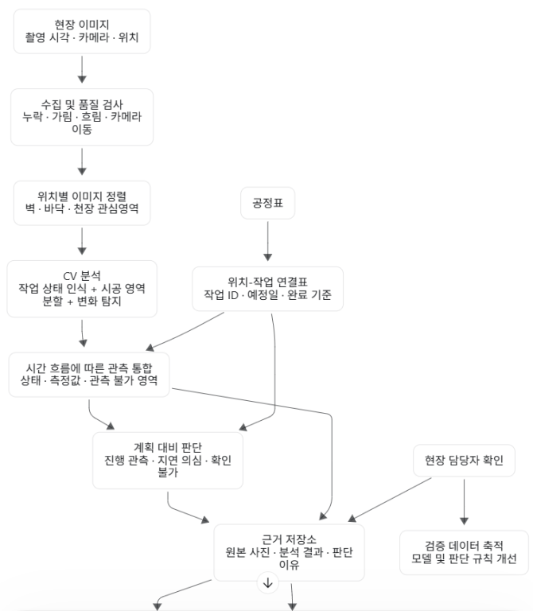
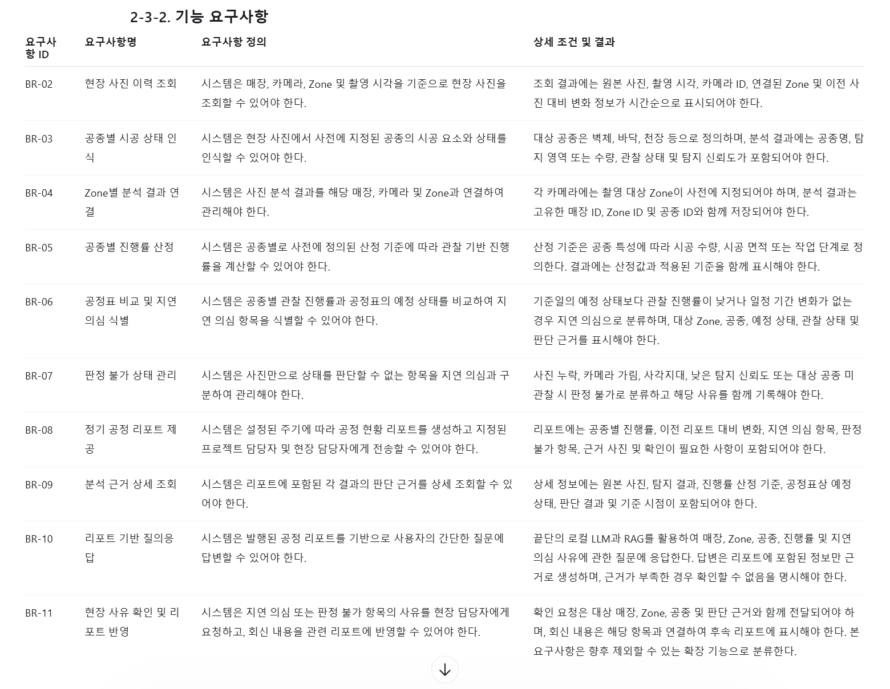
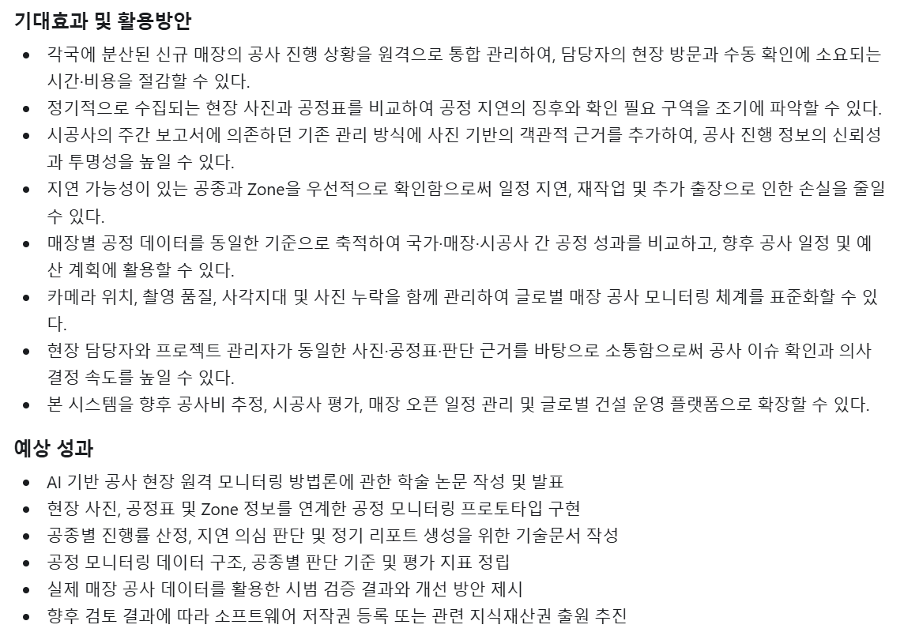

# A안 우선 추진 및 수행계획·요구 분석 논의

## 회의 요약

A안(이미지 기반 건설 진행률 모니터링)을 우선 추진하기로 결정하였으며, 실제 알로요가 측에서 제공 가능한 데이터의 종류와 범위에 따라 향후 B안으로 전환할 가능성을 열어두기로 했다. 9월 21일 첫 발표에서는 수행계획 및 요구사항 분석을 중심으로 시스템 구조, 입력·출력, 기술스택, 추진일정, 역할분담 및 예상 성과를 발표하고, 이후 Andy에게 A안과 B안의 선행연구 및 필요 데이터·예상 결과를 비교한 자료를 전달하기로 했다.

## 1. 회의 목적 및 안건

### 회의 목적

알로요가 산학 프로젝트의 수행 방향을 정하고, 첫 발표에 필요한 수행계획 및 요구사항을 구체화한다.

### 주요 안건

- A안과 B안 중 우선 추진할 과제 선정
- A안 수행을 위한 시스템 구조 및 요구사항 정리
- 9월 21일 첫 발표 내용 및 담당자 결정
- A안·B안 선행연구 및 필요 데이터 정리 방향 결정
- 프로젝트 역할 분담 및 추진 일정 검토

## 2. 논의 내용

### 안건 1. A안·B안 추진 방향

A안과 B안 중 우선 A안을 채택하기로 하였다. 단, 알로요가 측에서 제공할 수 있는 데이터의 종류와 범위에 따라 프로젝트 중간에 B안으로 변경할 가능성도 있음을 확인하였다.

### 안건 2. 다음 회의 전 A안·B안 선행연구 및 자료 준비

다음 회의 때 Andy에게 A안에 대한 선행연구와 논문을 정리하여 PPT 등의 자료로 전달하기로 하였다.

자료에는 A안과 B안 각각에 대해 다음 내용을 정리한다.

#### A안

1. A안을 수행할 경우 어떤 작업을 수행할 것인지 정리
2. A안을 수행하기 위해 어떤 정보가 필요할 것인지 정리
3. 특정 Input이 들어왔을 때 어떤 Output이 나오는지 정리

#### B안

1. B안을 수행할 경우 어떤 작업을 수행할 것인지 정리
2. B안을 수행하기 위해 어떤 정보가 필요할 것인지 정리
3. 특정 Input이 들어왔을 때 어떤 Output이 나오는지 정리

해당 자료는 알로요가 측에 프로젝트 수행 방향과 필요한 데이터에 대해 설명하고, 실제 제공 가능한 데이터의 범위를 확인하기 위한 자료로 활용한다.

### 안건 3. 9월 21일 첫 발표

9월 21일 첫 발표는 **수행계획 및 요구 분석** 발표로 진행하기로 하였으며, 팀원 **강태웅**이 발표하기로 하였다.

#### 1) 과제 목적 및 필요성

**목적**

사진(이미지)을 통하여 건설 진행률 파악, 진행률 파악 및 보고 에이전트 개발

**필요성**

해외 현장의 건설 진행률 파악을 위해서는 현장 방문과 주간 보고에만 의존하는 문제가 있어, 비용적·시간적 소요가 과다하다.

**세부 사항**

내부 인테리어적으로 천장, 바닥, 벽 등의 변화를 토대로 공정표와 비교하며 진행 상황을 파악한다.

건설이 지연될 경우 지연 의심 근거를 사진과 함께 보고하는 기능도 가능하면 넣어본다.

다만 학습 방법이 너무 적은 상황이므로 메인 기능보다는 부가 기능 확장성으로 미루어두는 편이 좋을 것 같음.

#### 2) 과제 내용 및 추진방법

**시스템 전체 구조(대표그림)**

사진 > (AI 모델) > 진행률 파악 > 진행 상황 보고서 작성

공정표는 스케줄이기 때문에 도면이 따로 필요하다.

해당 사진자료에 Input, Output을 추가하여 발표자료를 만들 것.

**사용할 기술스택/프레임워크 등**

- 개발 언어 = 파이썬
- 이미지 전처리 = OpenCV
- 딥러닝 = 파이토치

**개발 최종 목표(시스템 범위)**

- 정확도 90% 이상의 예측 모델 개발
- 로컬 LLM을 활용한 자동화 파이프라인 구성
- 산업에 실제로 적용함으로서 영업 이익 창출

**요구분석**

**개발 환경 및 도구, 협업툴 등**

- VS Code
- Github

#### 3) 과제 추진 일정

- Gantt 차트로 표현
- Task별 담당자 명시
- 요구분석을 참조하여 완성

**멘토/팀원과의 회의 일정 및 방법**

- 팀 회의 일정 = 매주 토
- 메일로 시간 협의 후 결정
- 10월 중 오프라인

#### 4) 기대효과 및 활용방안

- 각국에 분산된 신규 매장의 공사 진행 상황을 원격으로 통합 관리하여, 담당자의 현장 방문과 수동 확인에 소요되는 시간·비용을 절감할 수 있다.
- 정기적으로 수집되는 현장 사진과 공정표를 비교하여 공정 지연의 징후와 확인 필요 구역을 조기에 파악할 수 있다.
- 시공사의 주간 보고서에 의존하던 기존 관리 방식에 사진 기반의 객관적 근거를 추가하여, 공사 진행 정보의 신뢰성과 투명성을 높일 수 있다.
- 지연 가능성이 있는 공종과 Zone을 우선적으로 확인함으로써 일정 지연, 재작업 및 추가 출장으로 인한 손실을 줄일 수 있다.
- 매장별 공정 데이터를 동일한 기준으로 축적하여 국가·매장·시공사 간 공정 성과를 비교하고, 향후 공사 일정 및 예산 계획에 활용할 수 있다.
- 카메라 위치, 촬영 품질, 사각지대 및 사진 누락을 함께 관리하여 글로벌 매장 공사 모니터링 체계를 표준화할 수 있다.
- 현장 담당자와 프로젝트 관리자가 동일한 사진·공정표·판단 근거를 바탕으로 소통함으로써 공사 이슈 확인과 의사결정 속도를 높일 수 있다.
- 본 시스템을 향후 공사비 추정, 시공사 평가, 매장 오픈 일정 관리 및 글로벌 건설 운영 플랫폼으로 확장할 수 있다.

#### 5) 예상 성과

- AI 기반 공사 현장 원격 모니터링 방법론에 관한 학술 논문 작성 및 발표
- 현장 사진, 공정표 및 Zone 정보를 연계한 공정 모니터링 프로토타입 구현
- 공종별 진행률 산정, 지연 의심 판단 및 정기 리포트 생성을 위한 기술문서 작성
- 공정 모니터링 데이터 구조, 공종별 판단 기준 및 평가 지표 정립
- 실제 매장 공사 데이터를 활용한 시범 검증 결과와 개선 방안 제시
- 향후 검토 결과에 따라 소프트웨어 저작권 등록 또는 관련 지식재산권 출원 추진

주어진 형식에 개요별 어떤 내용을 넣어야 할지 정리하기로 하였다.

예상 성과 항목은 다음과 같은 형식을 검토한다.

- 논문
- 특허
- SW 등록
- 앱등록
- 기술문서 등

#### 6) 역할 분담

- 이윤한, 강태웅 : 전처리, Vision AI
- 강원준, 김병조 : Agentic AI, 문서 작성

### 안건 4. A안 관련 기능 및 요구사항 확인

A안의 시스템 요구사항은 업로드된 기능 요구사항 자료를 기준으로 확인하였다.

#### BR-02. 현장 사진 이력 조회

시스템은 매장, 카메라, Zone 및 촬영 시각을 기준으로 현장 사진을 조회할 수 있어야 한다. 조회 결과에는 원본 사진, 촬영 시각, 카메라 ID, 연결된 Zone 및 이전 사진 대비 변화 정보가 시간순으로 표시되어야 한다.

#### BR-03. 공종별 시공 상태 인식

시스템은 현장 사진에서 사전에 지정된 공종의 시공 요소와 상태를 인식할 수 있어야 한다. 대상 공종은 벽체, 바닥, 천장 등으로 정의하며, 분석 결과에는 공종명, 탐지 영역 또는 수량, 관찰 상태 및 탐지 신뢰도가 포함되어야 한다.

#### BR-04. Zone별 분석 결과 연결

시스템은 사진 분석 결과를 해당 매장, 카메라 및 Zone과 연결하여 관리해야 한다. 각 카메라에는 촬영 대상 Zone이 사전에 지정되어야 하며, 분석 결과는 고유한 매장 ID, Zone ID 및 공종 ID와 함께 저장되어야 한다.

#### BR-05. 공종별 진행률 산정

시스템은 공종별로 사전에 정의된 산정 기준에 따라 관찰 기반 진행률을 계산할 수 있어야 한다. 산정 기준은 공종 특성에 따라 시공 수량, 시공 면적 또는 작업 단계로 정의한다. 결과에는 산정값과 적용된 기준을 함께 표시해야 한다.

#### BR-06. 공정표 비교 및 지연 의심 식별

시스템은 공종별 관찰 진행률과 공정표의 예정 상태를 비교하여 지연 의심 항목을 식별할 수 있어야 한다. 기준일의 예정 상태보다 관찰 진행률이 낮거나 일정 기간 변화가 없는 경우 지연 의심으로 분류하며, 대상 Zone, 공종, 예정 상태, 관찰 상태 및 판단 근거를 표시해야 한다.

#### BR-07. 판정 불가 상태 관리

시스템은 사진만으로 상태를 판단할 수 없는 항목을 지연 의심과 구분하여 관리해야 한다. 사진 누락, 카메라 가림, 사각지대, 낮은 탐지 신뢰도 또는 대상 공종 미관찰 시 판정 불가로 분류하고 해당 사유를 함께 기록해야 한다.

#### BR-08. 정기 공정 리포트 제공

시스템은 설정된 주기에 따라 공정 현황 리포트를 생성하고 지정된 프로젝트 담당자 및 현장 담당자에게 전송할 수 있어야 한다. 리포트에는 공종별 진행률, 이전 리포트 대비 변화, 지연 의심 항목, 판정 불가 항목, 근거 사진 및 확인이 필요한 사항이 포함되어야 한다.

#### BR-09. 분석 근거 상세 조회

시스템은 리포트에 포함된 각 결과의 판단 근거를 상세 조회할 수 있어야 한다. 상세 정보에는 원본 사진, 탐지 결과, 진행률 산정 기준, 공정표상 예정 상태, 판단 결과 및 기준 시점이 포함되어야 한다.

#### BR-10. 리포트 기반 질의응답

시스템은 발행된 공정 리포트를 기반으로 사용자의 간단한 질문에 답변할 수 있어야 한다. 끝단의 로컬 LLM과 RAG를 활용하여 매장, Zone, 공종, 진행률 및 지연 의심 사유에 관한 질문에 응답한다. 답변은 리포트에 포함된 정보만 근거로 생성하며, 근거가 부족한 경우 확인할 수 없음을 명시해야 한다.

#### BR-11. 현장 사유 확인 및 리포트 반영

시스템은 지연 의심 또는 판정 불가 항목의 사유를 현장 담당자에게 요청하고, 회신 내용을 관련 리포트에 반영할 수 있어야 한다. 확인 요청은 대상 매장, Zone, 공종 및 판단 근거와 함께 전달되어야 하며, 회신 내용은 해당 항목과 연결하여 후속 리포트에 표시해야 한다. 본 요구사항은 향후 제외할 수 있는 확장 기능으로 분류한다.

## 3. 결정 사항

- A안을 우선 채택한다.
- 알로요가 측에서 제공 가능한 데이터에 따라 중간에 B안으로 변경할 수 있다.
- 9월 21일 첫 발표는 강태웅이 담당한다.
- 첫 발표 주제는 수행계획 및 요구 분석으로 한다.
- 첫 발표에 과제 목적 및 필요성, 과제 내용 및 추진방법, 과제 추진 일정, 기대효과 및 활용방안, 예상 성과, 역할 분담을 포함한다.
- 시스템의 기본 방향은 사진 → AI 모델 → 진행률 파악 → 진행 상황 보고서 작성으로 한다.
- 개발 언어는 파이썬, 이미지 전처리는 OpenCV, 딥러닝은 파이토치를 사용한다.
- 개발환경 및 협업도구는 VS Code / Github로 한다.
- 개발 최종 목표는 정확도 90% 이상의 예측 모델 개발, 로컬 LLM을 활용한 자동화 파이프라인 구성, 산업 현장 적용을 통한 영업 이익 창출로 정리한다.
- 지연 의심 근거를 사진과 함께 보고하는 기능은 가능하면 포함하되, 현재 학습 방법이 충분하지 않은 점을 고려하여 메인 기능보다는 부가 기능 확장성으로 미루는 방향으로 검토한다.
- 다음 회의에서 Andy에게 전달할 A안·B안 선행연구 및 논문 정리 자료는 김병조가 9월 22일까지 제작한다.
- 역할 분담은 이윤한·강태웅 = 전처리 및 Vision AI / 강원준·김병조 = Agentic AI 및 문서 작성으로 한다.

## 4. 후속 업무

| 업무 | 담당자 | 기한 | 완료 기준 |
|---|---|---|---|
| A안·B안 선행연구 및 논문 정리, 각 안의 수행 내용·필요 정보·Input·Output을 정리한 PPT 자료 제작 | 김병조 | 9/22 | A안·B안의 선행연구와 프로젝트 적용 시 필요한 정보 및 Input·Output이 정리된 PPT 자료 완성 |
| 9월 21일 수행계획 및 요구 분석 발표자료 준비 및 발표 | 강태웅 | 9/21 | 과제 목적 및 필요성, 과제 내용 및 추진방법, 추진 일정, 기대효과 및 활용방안, 예상 성과, 역할 분담이 포함된 발표자료 작성 및 발표 완료 |

## 5. 미결 사항 · 확인할 질문

| 추가 확인이 필요한 내용 | 확인 담당 | 확인 시점 |
|---|---|---|
| 알로요가 측에서 실제로 제공 가능한 현장 사진의 종류와 범위 | 팀 / Andy | 다음 회의 |
| 현장 사진에 포함된 촬영 시간·카메라·위치 정보의 제공 및 활용 가능 여부 | 팀 / Andy | 다음 회의 |
| 공정표 제공 가능 여부 및 공정표의 형식 | 팀 / Andy | 다음 회의 |
| A안 수행에 필요한 데이터가 실제로 확보 가능한지 여부 | 팀 / Andy | 다음 회의 |
| 제공 데이터에 따라 A안을 계속 진행할지 B안으로 변경할지 여부 | 팀 | 데이터 확인 후 |
| 지연 의심 및 사진 근거 보고 기능을 최종 시스템 범위에 포함할지 여부 | 팀 | 향후 검토 |
| 10월 중 오프라인 멘토 회의의 구체적인 날짜·시간·장소 | 팀 | 일정 협의 후 |

## 6. 다음 회의 및 참고자료

### 다음 회의

**9월 21일(월): 수업 내 프로포절 발표 예정**

주요 안건:
- A안·B안 선행연구 및 논문 정리 자료 공유
- 각 안의 필요 데이터 및 Input·Output 확인
- 알로요가 측 제공 데이터 범위 확인
- 데이터 조건에 따른 최종 프로젝트 방향 검토

### 참고자료

- A안 시스템 전체 구조 자료
- 기능 요구사항(BR-02 ~ BR-11)
- 기대효과 및 활용방안 자료
- 예상 성과 관련 자료
- A안·B안 선행연구 및 논문 정리 자료
- GitHub 프로젝트 저장소

